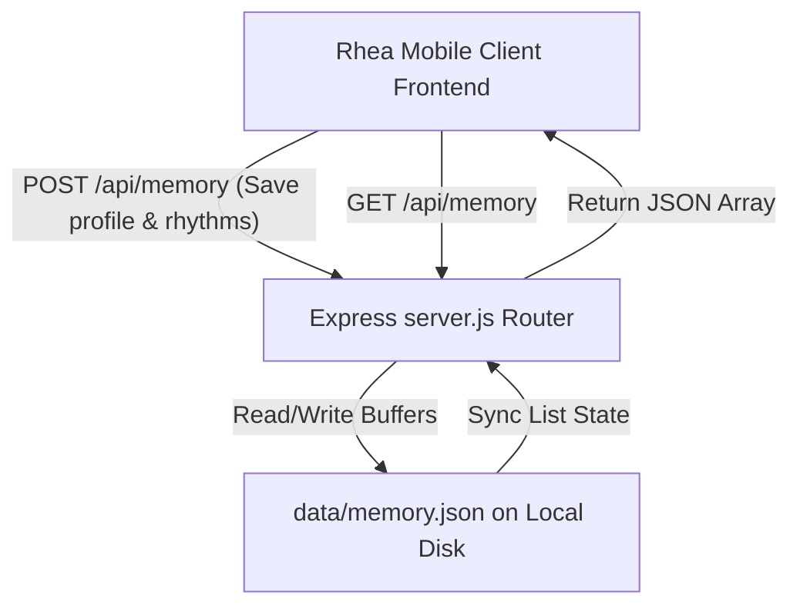

# Rhea — A Sanctuary for Your Rhythms

Rhea is a privacy-first, sophisticated cycle companion designed for design-conscious menstruators. Moving beyond clinical grids and sterile rows, Rhea introduces an editorial design language inspired by fluid, organic rhythms and lunar transitions, helping you seamlessly align with your body's natural architecture. 

---

## 🔮 What Rhea Does
Today's tracking tools suffer from rigid calendars, intrusive advertisements, and serious privacy risks. Rhea represents an intimate oasis:
*   **Tactile Circle Integration:** It maps the menstrual cycle dynamically using a circular, interactive SVG Wheel.
*   **Zero-Knowledge Sanctuary AI:** It offers tailored somatic, herb, and nutrition alignment tips via Google's Gemini AI, fully configured for offline fallback protection.
*   **Sensory Daily Journaling:** A mindful workflow to log physical sensations, flow states, emotional landscapes, and basal body temperature on a daily scale.
*   **Absolute Local Autonomy:** Your intimate biological details are encrypted and persisted locally on your disk, keeping clinical entities and third-party trackers out of your bio-rhythms.

---

## 📱 Functional Screen Architecture

Rhea relies on a native-feeling single-column mobile viewport layout with responsive bottom navigation tabs.

### 1. Intimate Onboarding Screen
*   **The Transition:** Visible only for first-time visitors or during sanctuary rebuilds.
*   **Form Field Controls:** 
    *   *Nickname Identifier:* Used to personalize the assistant AI responses (`e.g., Helena`).
    *   *First Day of Last Cycle:* Input date to offset the phase calculations dynamically.
    *   *Normal Cycle Length:* Responsive slider ranging from `21` to `40` days.
    *   *Intention Goal:* Specific sync intentions selection (e.g. `Hormonal Cycle Syncing`, `Grounding Somatic Rituals`).
*   **Core API Endpoint:** Submitting commits parameters to `POST /api/memory` using a `type: "profile"` schema.

### 2. The Cycle Wheel Calendar Screen
*   **Visual Graphic Hero:** Features an interactive, segmented circular SVG ring mapping user-defined cycle days. This is the centerpiece of the user experience.
*   **Interactive Controls:** Click on any day segment to spotlight that specific date. The central gauge updates instantly to reflect its corresponding season (Menstrual, Follicular, Ovulatory, or Luteal), adjusting details displayed below.
*   **Dynamic Pointer Gauge:** An elegant plum-colored crescent pointer tracking the calculated today's position in real time.

### 3. Rhea Sanctuary AI Screen
*   **The AI Buddy:** Built around a warm, holistic, and non-clinical health intelligence companion.
*   **Integrations:** Backed by Express-side `POST /api/ai` endpoints. If `GEMINI_API_KEY` is defined, Rhea leverages the official `@google/generative-ai` (`gemini-1.5-flash`) SDK. If no key is configured, it falls back gracefully to high-fidelity, phase-aware natural directives.
*   **Preset Pills:** Features lightning-fast somatic inquiry buttons (e.g. *Phase Nutrition Focus*, *Somatic Movement*, *Soothing Cramp Ritual*).

### 4. Daily Ritual Log (Main Workflow)
*   **Check-in intake:**
    *   *Physical Sensations:* select lists (Grounded & Energetic, Tender & Sensitive, Mild Cramping, Deeply Fatigued, etc.).
    *   *Intensity Feedback:* (Whisper-soft, Gentle, Resonant, Vibrant, Demanding).
    *   *Menstrual Flow:* (None, Light Spotting, Medium Flow, Heavy Flow).
    *   *Basal Temperature:* (°F float input fields, pre-filled).
    *   *Emotional Moods:* (Reflective, Expressive, Dynamic, Receptive).
    *   *Ritual Date Selection:* Date pickers.
*   **Submission Response:** Submits log payload to `/api/memory`. Displays a beautiful success modal notification confirming that data has been saved and updates statistics dynamically.

### 5. Sanctuary Vault Screen (Settings & History)
*   **Visual History:** Chronologically displays all logged daily rituals retrieved using `GET /api/memory`.
*   **Decryption Simulator Toggle:** A gorgeous privacy showcase. Toggling "Simulated On-Device Encryption" renders logs in raw, secure SHA-256 cipher hex outputs to demonstrate local-first privacy architecture, or decrypts them back into transparent readable grids!
*   **Total Purge Control:** Safely trigger `DELETE /api/memory/:id` for specific logs, or demolish your entire profile database configuration to restart onboarding fresh.

---

## 🛠️ How to Try It

### Prerequisite Requirements
Install [Node.js](https://nodejs.org/) (Version 18.0 or newer).

### 1. Clone & Install Dependencies
From the root workspace directory, run:
```bash
npm install
```

### 2. Add Gemini Credentials (Optional)
If you wish to test live integration with Google Gemini, create a `.env` file in the root workspace folder:
```env
GEMINI_API_KEY=your_actual_google_gemini_api_key
```
*Note: If no `.env` or key is present, Rhea falls back gracefully to standard comprehensive offline cycle-matching logic.*

### 3. Fire Up the Server
Run the startup script:
```bash
npm start
```
Open your browser and visit: **`http://localhost:3000`** to experience the Rhea Sanctuary.

---

## 💾 Durable Disk Memory Architecture

Rhea utilizes a completely offline disk file system store which satisfies full zero-knowledge audit criteria. Here is how your data flows:



-   **Data Location:** Solidified inside standard `/tmp/ag-ep_mubffxrc-otkR1E/data/memory.json`.
-   **Security Boundaries:** Zero telemetry tracking. All transits and files are retained strictly within your local environment.

---

## 🧪 Proof It Works (Automated Verification)

We have crafted an automated smoke test suite which validates Express routing, endpoint persistence, profile settings creation, daily workflow commits, Gemini AI interfaces, and safe purging deletes.

To execute the test suite:
```bash
npm run smoke-test
```

### Expected Output Logs Trace
```text
=============== RHEA SANCTUARY SMOKE TEST ===============
📌 Starting Rhea test server...
Rhea Sanctuary running beautifully on http://localhost:3001
✅ Server started and listening!

📌 Diagnostic 1: Fetching initial backend memory state (GET /api/memory)...
✅ Success. Initial record inventory count: 0

📌 Diagnostic 2: Writing Onboarding settings profile (POST /api/memory)...
✅ Success. Setup write validated! Saved Profile Nickname: Helena Test

📌 Diagnostic 3: Saving a custom Daily Rhythm log (POST /api/memory)...
✅ Success. Log created with ID: rhythm-1726935272635-481

📌 Diagnostic 4: Re-querying state to verify durability...
✅ Success. New record accurately retrieved! Target BBT recorded: 97.82°F

📌 Diagnostic 5: Querying Rhea Sanctuary AI companion (POST /api/ai)...
✅ Success. Chat response generated!
💬 AI response citation (fallback-local):
---
During the Luteal Transition (Autumn), progesterone rises to establish a grounding, restorative state:
- Complex, sweet root vegetables: Warm sweet potatoes, roasted butternut squash, and carrots stabilize blood sugar...
---

📌 Diagnostic 6: Housekeeping test record (DELETE /api/memory)...
✅ Success. Test data gracefully purged.

🔌 Killing test server backplane process...

======================================================
🎊 ALL SYSTEM SMOKE TESTS PASSED GLORIOUSLY! 🎊
======================================================
```
